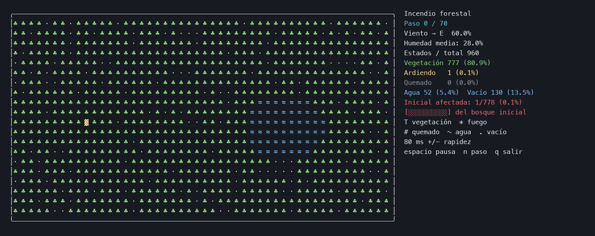

# Incendio forestal secuencial

Simulación de un incendio forestal para la Práctica 2 de Ingeniería de los Computadores (2026-27), en la Universidad de Alicante. El programa está escrito en C++17 y permite observar la propagación del fuego, estudiar el coste de cada iteración y analizar cómo repartir el trabajo entre varios procesadores.

## Ver cómo se propaga el fuego



El GIF muestra una ejecución real de 20 × 48 celdas, con semilla 42, humedad inicial del 28% y viento hacia el este al 60%. El fuego se extiende desde el foco inicial hasta extinguirse en el paso 44. El panel muestra los recuentos de celdas, la humedad media y el porcentaje de bosque afectado.

## Cómo funciona

El terreno contiene vegetación, fuego, zonas quemadas, agua y claros. Cada celda consulta sus ocho vecinos: la humedad dificulta el encendido y el viento favorece la propagación en su dirección. Cuando una celda arde, consume combustible hasta quedar quemada.

Cada iteración calcula la humedad y el fuego a partir del estado anterior. Se utilizan dos buffers para que el orden de recorrido no altere el resultado. La ejecución es secuencial; la propuesta de paralelización estudia el reparto por filas y la sincronización entre pasos.

La animación se controla desde el teclado:

| Tecla | Acción |
|---|---|
| Espacio | Pausar o reanudar. |
| `n` | Avanzar un paso cuando está pausada. |
| `+` / `-` | Acelerar o ralentizar. |
| `q` | Terminar y mostrar el resumen. |

## Compilar y ejecutar

Necesitas un compilador C++17 y `make`. Abre una terminal en la raíz del repositorio:

```sh
make CXX=g++
make visual                 # Animación de 20 × 48, hasta 70 pasos
make run                    # Medición de 1600 × 1600, 160 pasos
```

También puedes elegir los parámetros:

```sh
./incendio --visual --rows 20 --cols 48 --steps 70 --seed 42 \
  --moisture .28 --wind-dir E --wind .6 --delay 180
```

En macOS, `/usr/bin/g++` ejecuta Apple Clang. Las mediciones Linux/GCC se realizan con Docker ARM64 sobre un M2.

## Ejecutar con Docker

Con Docker Desktop abierto, construye la imagen y lanza la animación:

```sh
make docker-build
docker run --rm -it --platform linux/arm64 --cpus=2 --memory=2g \
  incendio-ic:practica2 ./incendio --visual --rows 20 --cols 48 --steps 70
```

`-it` permite ver los colores y usar el teclado. La imagen utiliza Ubuntu y compila el programa con GCC. Ejecuta de nuevo `make docker-build` después de modificar el código.

## Mediciones y gráficas

La campaña compara cuatro tamaños de terreno, cuatro cantidades de pasos y las opciones `-O0`, `-O2`, `-O3` y `-O3 -march=native`. Incluye tres repeticiones por caso, calentamientos y un diagnóstico del tiempo dedicado a humedad y fuego. Los resultados se muestran con medianas y rangos mínimo y máximo.

Puedes consultar las [gráficas](resultados_docker/mediciones_docker.svg), las [tablas de resultados](resultados_docker/mediciones_docker_resumen.md) y el [entorno de ejecución](resultados_docker/mediciones_docker_entorno.json). El [análisis de rendimiento](docs/rendimiento.md) explica el cronometraje, la fuente utilizada en cada medición y los informes de vectorización de GCC.

Para generar una campaña nueva en su propia carpeta:

```sh
make docker-measure DOCKER_RESULTS=resultados_docker_actual
make docker-vectorization DOCKER_RESULTS=resultados_docker_actual
```

Las gráficas se abren en un navegador o visor SVG. La animación del incendio se muestra en la terminal.

## Documentación

| Documento | Qué encontrarás |
|---|---|
| [Uso](docs/uso.md) | Argumentos, compilación, Docker, controles y lectura de la salida. |
| [Funcionamiento](docs/funcionamiento.md) | Reglas del modelo, doble buffer, memoria y explicación de los módulos. |
| [Rendimiento](docs/rendimiento.md) | Mediciones, gráficas, opciones de compilación y evidencia SIMD. |
| [Paralelización](docs/paralelizacion.md) | Dependencias, reparto por filas, barreras y estimaciones de ganancia. |
| [Historial](docs/historial.md) | Procedencia del código, decisiones y cambios realizados. |

## Organización del proyecto

```text
incendio-ic/
├── README.md
├── src/                  # Implementación de los cinco módulos C++
├── include/              # Tipos y declaraciones compartidos
├── scripts/              # Medición y comprobación
├── docs/                 # Explicación de la práctica y del código
│   └── figuras/          # GIF y grafo de dependencias
├── resultados_docker/    # Tablas, gráficas e informes de compilación
├── Makefile
└── Dockerfile
```

`src/main.cpp` coordina la ejecución. Las opciones, las reglas de simulación, las estadísticas y la terminal están separadas en sus propios módulos. Para seguir el código, empieza por `include/modelo.h`, continúa con `src/main.cpp` y revisa las reglas en `src/simulacion.cpp`.

## Uso de IA

Durante el desarrollo utilizamos OpenAI Codex con GPT-6 Astra para la planificación del proyecto y la preparación de las instrucciones de trabajo. GPT-6.1 Sol se utilizó para apoyar la implementación y refactorización del código, revisar la documentación y ejecutar procesos de compilación, medición y comprobación con Docker.

La elección del problema y las decisiones sobre el alcance, la organización del código y la presentación de resultados se tomaron a partir de las propuestas e indicaciones del equipo. La asistencia de IA incluyó generación de código y texto; los cambios se contrastaron mediante ejecuciones del programa, resultados y gráficas. El equipo es responsable de comprender y explicar el código y de las conclusiones que presente en la práctica.

El [historial de desarrollo](docs/historial.md) recoge las modificaciones y las comprobaciones realizadas.
