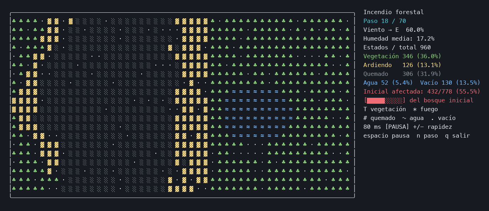

# Incendio forestal secuencial

Proyecto de la Práctica 2 de Ingeniería de los Computadores (2026-27). Simula la propagación de un incendio en una cuadrícula para estudiar su coste computacional. Usa C++17 y reglas simplificadas; su ejecución es secuencial.

## Empezar

Necesitas un compilador C++17 y `make`. Ejecuta estos comandos desde `incendio/`:

```sh
make CXX=g++
make visual                 # Animación de 20 × 48, hasta 70 pasos
make run                    # Referencia de 1600 × 1600, 160 pasos
```

Para animar con Docker Desktop:

```sh
make docker-build
docker run --rm -it --platform linux/arm64 --cpus=2 --memory=2g \
  incendio-ic:practica2 ./incendio --visual --rows 20 --cols 48 --steps 70
```

En macOS, `/usr/bin/g++` ejecuta Apple Clang. La práctica pide Linux/GCC para las mediciones: las campañas disponibles se hicieron en Docker ARM64 sobre un M2.

## Animación de la propagación



Fotograma de una ejecución real de 20 × 48 celdas, semilla 42, humedad inicial del 28% y viento hacia el este al 60%. En el paso 18 hay 126 celdas ardiendo y 306 quemadas. El panel muestra el estado del terreno y la proporción de bosque afectado. Puedes ejecutar la animación con `make visual`.

## Documentación

| Documento | Qué encontrarás |
|---|---|
| [Uso](docs/uso.md) | Compilación, Docker, argumentos, controles y lectura de la salida. |
| [Funcionamiento](docs/funcionamiento.md) | Reglas, doble buffer, memoria y recorrido por los módulos. |
| [Rendimiento](docs/rendimiento.md) | Referencia, cronometraje, campañas, gráficas y evidencia SIMD. |
| [Paralelización](docs/paralelizacion.md) | Dependencias, reparto de filas, sincronización y ganancias estimadas. |
| [Historial](docs/historial.md) | Procedencia, decisiones y cambios con sus comprobaciones. |

## Carpetas

```text
incendio/
├── README.md
├── docs/
│   ├── uso.md
│   ├── funcionamiento.md
│   ├── rendimiento.md
│   ├── paralelizacion.md
│   ├── historial.md
│   └── figuras/          # Grafo de dependencias y captura de la animación
├── src/                  # Implementación C++
├── include/              # Tipos y declaraciones
├── scripts/              # Medición y comprobación
├── resultados_docker/    # Campañas e informes históricos
├── Makefile
└── Dockerfile
```

La [campaña archivada](resultados_docker/mediciones_docker_resumen.md) corresponde a la [fuente monolítica](resultados_docker/fuente_medida.cpp). La versión actual está modularizada y tiene estadísticas visuales coloreadas. Los resultados archivados identifican la fuente y el entorno exactos con los que se midieron. Para obtener resultados nuevos sin sustituir los históricos, sigue los comandos de [rendimiento](docs/rendimiento.md).
