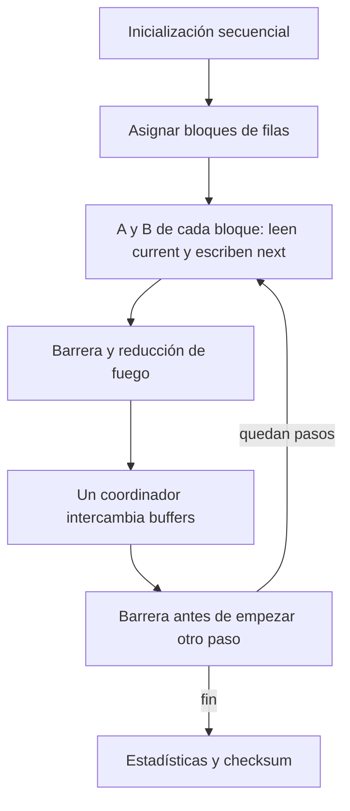

# Propuesta de paralelización

[Inicio](../README.md) · [Uso](uso.md) · [Funcionamiento](funcionamiento.md) · [Rendimiento](rendimiento.md) · [Paralelización](paralelizacion.md) · [Historial](historial.md)

La aplicación entregada por ahora es secuencial. Aquí se recogen las dependencias y las alternativas que podríamos desarrollar en una práctica posterior. Las ganancias calculadas son estimaciones.

## Grafo de dependencias para revisión visual

[Ver el grafo SVG](figuras/dependencias.svg). Se corresponde con `initialize`, `update_moisture`, `update_fire`, el intercambio en `main`, `statistics` y `checksum`. Muestra dependencias lógicas; la ejecución actual de A y B continúa siendo secuencial.

## Propuesta concreta para una futura versión multinúcleo

Primera arquitectura: CPU con memoria compartida. Repartir filas completas en bloques contiguos y aproximadamente iguales; mantener el mismo reparto entre iteraciones. Cada trabajador lee `current`, incluidos los vecinos de filas de otro bloque, y escribe solo su bloque de `next`. En memoria compartida esas filas frontera se leen directamente: no se necesitan copias de halos como en un clúster.

Una organización posible es que cada trabajador ejecute A y B para su bloque, seguido de una barrera global. Cada bloque acumula localmente su número de celdas con fuego; combinar por suma, o por OR si solo interesa saber si hay fuego. Un único coordinador intercambia los buffers y actualiza contadores; una segunda barrera permite empezar el siguiente paso con los punteros nuevos. Evitar crear hebras por iteración: usar un equipo persistente. La versión paralela deberá seguir leyendo la humedad actual y respetar el orden de suma de vecinos dentro de cada celda.

La versión actual sigue siendo secuencial. Repartir filas completas reduce escritura intercalada, aunque no garantiza eliminar false sharing en los límites: dos bloques pueden tocar una misma línea de caché. Ejecutar toda A en un núcleo y toda B en otro es otra posibilidad funcional: escriben miembros diferentes, sin dependencia lógica, pero pueden disputar las mismas líneas de caché de `next`. Ese solapamiento debe medirse en la práctica posterior.

La carga por fila tampoco es idéntica: árboles consultan ocho vecinos, mientras que agua, claros y celdas quemadas hacen menos trabajo. Empezar con bloques estáticos; considerar reparto dinámico solo si se observa desequilibrio suficiente para compensar el coste de planificación. GPU queda como alternativa para terrenos grandes, manteniendo ambos buffers residentes en el dispositivo; clúster requeriría intercambiar filas frontera en cada paso y evaluar el coste de comunicación.

## Ganancia y eficiencia: escenarios teóricos

Para `p` trabajadores y fracción secuencial `f`, el modelo ideal de Amdahl da `S(p)=1/(f+(1-f)/p)` y `E(p)=S(p)/p`. La tabla siguiente usa f=0.05 como supuesto ilustrativo, no como porcentaje medido:

| Trabajadores p | Ganancia ideal S | Eficiencia ideal E |
|---:|---:|---:|
| 2 | 1.905 | 95.24% |
| 4 | 3.478 | 86.96% |
| 8 | 5.926 | 74.07% |

El cronómetro de rendimiento excluye inicialización y estadísticas: cualquier estimación debe aclarar si se refiere al bucle o al programa completo. El resto del diagnóstico incluye coste del reloj y no sirve para medir directamente `f`. Barreras, reducción, caché, ancho de banda y desequilibrio pueden reducir las ganancias de la tabla. No hay ganancia paralela medida todavía.

## Paralelismo funcional a partir del diagnóstico

La campaña Docker con GCC `-O2 -ffp-contract=off` sitúa las fases alrededor del 44.756% (humedad) y 55.243% (fuego) del bucle de diagnóstico, usando medianas de porcentajes por ejecución. Con las medianas de sus tiempos, solapar únicamente esas dos tareas daría un límite ideal de `(3.695409+4.652535)/max(3.695409,4.652535) ≈ 1.79` y eficiencia de aproximadamente 89.7% para dos trabajadores. Este cálculo supone que cada fase conserva su tiempo al ejecutarse junto a la otra y que no hay sobrecoste; no se ha medido ese solapamiento y ambas podrían disputar memoria/caché.

El reparto por filas ofrece más unidades de trabajo que asignar una fase a cada núcleo y es la primera propuesta para la práctica posterior. Los porcentajes de fase no constituyen una fracción secuencial de Amdahl: ambas fases son repartibles por datos. Véanse [rendimiento.md](rendimiento.md) para dispersión y [rendimiento.md](rendimiento.md) para mensajes concretos de GCC.

## Alternativa para organizar los datos

La organización actual es un array de estructuras (AoS): los datos de una celda están juntos y el código es sencillo. Una alternativa futura consiste en arrays separados (SoA) para humedad, combustible y estado. Dos juegos de esos arrays necesitarían aproximadamente `2 × N × (4+1+1) = 12N` bytes de elementos: 30 720 000 bytes para la referencia, un 25% menos que los `16N` actuales, sin contar metadatos/capacidad. Además permitirían cargar estados consecutivos sin el resto de la celda. Esto es una comparación de tamaños, no una mejora de tiempo medida; conservar AoS hasta que una comparación real justifique migrar.
